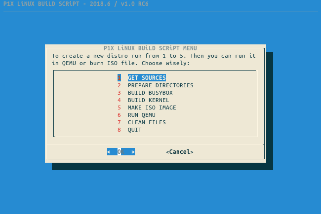
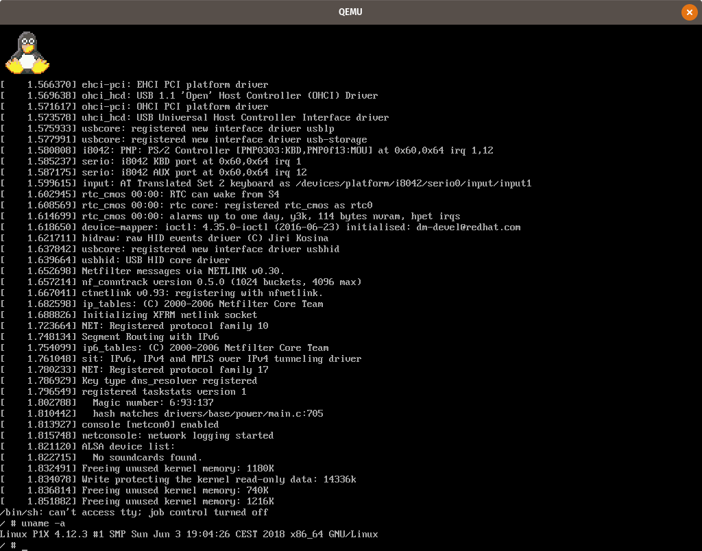

# 

## About

This scripts generates working Linux ISO image (7.8MiB). It is very, very small and basic.
The script below uses **Linux kernel 4.7.6**, **BusyBox 1.24.2** and **Syslinux 6.03**.

## Linux

- Linux kernel
- GNU C library compiled with default options
- BusyBox compiled with default options
- quite simple initramfs structure
- custom TUX logo
- vi

TODO:
- ncurses
- nano

## Media

## Requiments

Around **1.5GiB** free space.

For Debian/Ubuntu you'll need

    sudo apt-get install wget bc build-essential gawk xorriso dialog qemu texinfo

Then just run the script

    ./build-linux.sh

## History

I found out about [Minimal Linux Script](https://github.com/ivandavidov/minimal-linux-script) and [Minimal Linux Live](http://github.com/ivandavidov/minimal).

I fall in love with the idea. Started messing around.

I created my own script. With black-jack and hookers.
